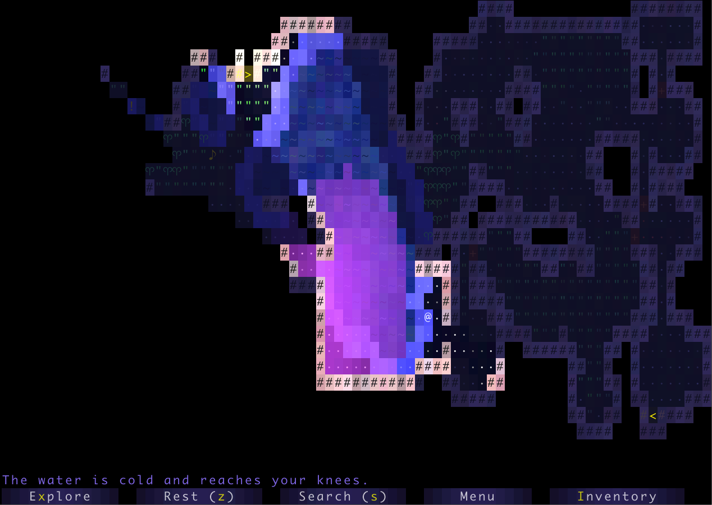

# 🌍 World Explorer — Tile-Based World Engine (Java)

A compact engine that **generates and explores 2D tile worlds**. The world is drawn on a grid, built from seeded randomness, explored via **W/A/S/D**, and can be **saved/loaded** deterministically. A lightweight **HUD** shows tile info under the cursor.

---



## 1) Quick Start

```bash
# from the project root
javac -d out $(find "world explorer/src" -name "*.java")

# run the keyboard UI
java -cp out core.Main
````

### New World

* Press **`N`**, type a numeric **seed**, then press **`S`**.

### Load Last Save

* Press **`L`**.

### Quit + Save

* Type **`:Q`** during exploration (no extra prompts).

---

## 2) Controls

* **W / A / S / D** — move up / left / down / right
* **:Q** — save current world and exit
* **Mouse hover** — HUD shows tile description (e.g., “floor”, “wall”)

---

## 3) Project Structure

```
world explorer/
└── src/
    ├── core/
    │   ├── Main.java          # entry point & main menu (New, Load, Quit)
    │   ├── worldGen.java      # world generation pipeline
    │   ├── SaveLoad.java      # save/load world + replay data
    │   └── HUD.java           # heads-up display (tile descriptions)
    │
    ├── tileengine/
    │   ├── TERenderer.java    # screen/renderer
    │   ├── TETile.java        # tile type (char/image, colors, description)
    │   └── Tileset.java       # stock tiles (floor, wall, avatar, etc.)
    │
    └── utils/
        └── RandomUtils.java   # seeded RNG helpers

save.txt
```

> **Compiled classes** live in `out/` (ignored by Git).

---

## 4)Techniques Used

> The world generator is intentionally simple and reproducible. Below is what powers it.

### Randomness & Determinism

* **Seeded RNG** using `java.util.Random` so the same seed + same inputs always produce the *same* world and behavior.
* **Replayability** via a compact log of inputs; loading replays the inputs to restore exact state.

### Map Layout & Generation

* **Grid representation**: `TETile[][] world` with `(x, y)` indexing, where `world[0][0]` is bottom-left.
* **Rectangular Room Placement** (rejection sampling):

  * Sample `(w, h)` in bounds, sample `(x, y)` so room fits.
  * **Overlap test** with a one-tile margin to keep walls/floors clean.
  * Place if non-overlapping; otherwise retry until a target count or retry-limit is reached.
* **Hallway Carving** (Manhattan / L-shaped connectors):

  * For each new room, connect its center to a nearby room’s center.
  * Carve an **orthogonal L** (either horizontal-then-vertical or vertical-then-horizontal).
  * Hallways are **width 1**; corners become turns.
* **Connectivity Guarantee**:

  * Build a **graph** of rooms (node per room, edge per carved connection).
  * Ensure at least a **spanning connectivity** (effectively a forest → tree).
  * After carving, run a **BFS flood-fill** from one floor tile and verify all floor tiles are reachable; if not, add connectors.
* **Dead-End Handling** (light pruning / backfill):

  * Detect floor tiles with only one floor neighbor (degree-1 corridor cells).
  * Optionally backfill those ends into walls for cleaner maps, or connect them to nearest corridor to remove dead ends.
* **Boundary Safety**:

  * Never place floors on the outermost frame; keep a one-tile **wall border**.
* **Tile Semantics**:

  * `Tileset.WALL` for enclosure, `Tileset.FLOOR` for walkable space, optional `Tileset.AVATAR` for player start.

### Movement & Collision

* **Avatar movement** constrained to **floor** tiles; attempts to move into a **wall** are ignored.
* Coordinates are consistent with rendering and HUD sampling.

### HUD & Interaction

* **HUD sampling**: reads the tile under the mouse and prints its `description()` (from `TETile`).
* Optional helpers for additional status text (e.g., steps, seed, messages).

### Saving & Loading

* **Plain-text persistence** (`save.txt`):

  * Stores **seed** + **input string** (replay log).
  * Load: rebuilds RNG with the seed, generates the world, then **replays inputs** to recover state.
  * This approach is small, robust, and guarantees determinism without serializing complex objects.

### Utility Helpers

* **RandomUtils**: convenience wrappers for inclusive/exclusive random ranges, coin flips, and seeded `Random` creation.

---

## 5) Example Inputs (Deterministic)

* **Seeded run with movement**

  * Input: `N3412SWWAA`
  * Meaning: new world with seed `3412`, then move Up, Up, Left, Left

* **Save and continue later**

  * First run: `N25SDDWD:Q` → save & quit
  * Next run: `LDDDD` → load last save, then move Right×4

Both methods end with the exact *same* world state as if those keypresses were made live.

---


```
```
